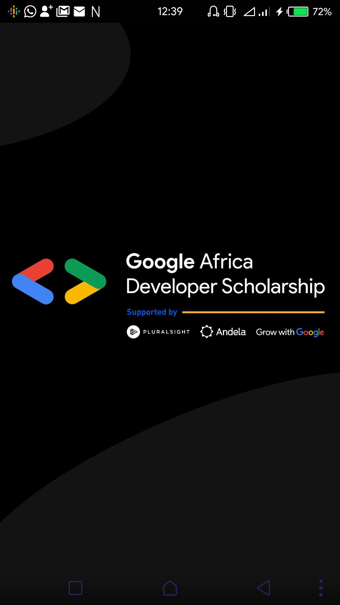

# ASSOCIATE ANDROID DEVELOPER PRACTICE PROJECT

A practice project for the Android track of the Google Andela Developer Scholarship.
The application consumes the [GADS API](https://gadsapi.herokuapp.com/) to display a list 
of learners with high hour scores and high skill IQ scores. 
Additionally, the application is used to submit a Google Form for the same application.
Libraries used include:
1. [Retrofit](https://github.com/square/retrofit) to fetch and send data
1. [Room](https://developer.android.com/topic/libraries/architecture/room) for caching the data locally
1. [Glide](https://github.com/bumptech/glide) to display and cache images
[Download APK](https://github.com/tonyawino/associate-android-developer-practice-project/raw/master/screenshots/app-debug.apk)

